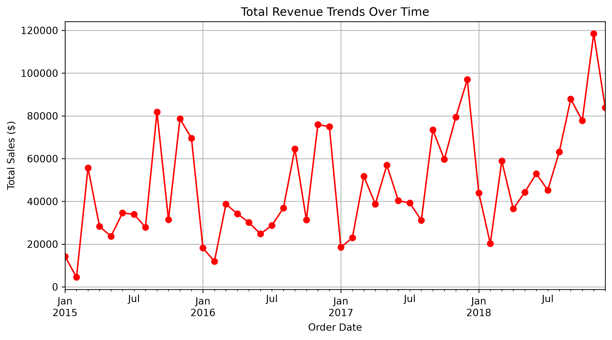
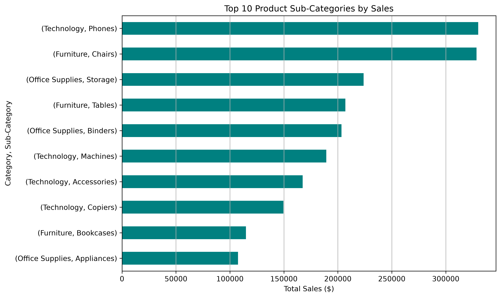
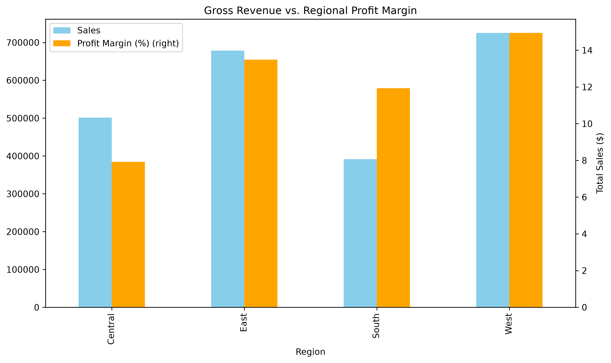
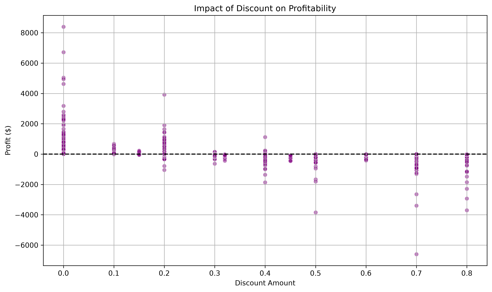

# 📊 Superstore Revenue Diagnostic

A beginner-friendly Python project for exploring retail sales data and turning it into simple business insights.

## ✨ What this project shows

- 📈 Revenue trends over time
- 🏷️ Top-performing product sub-categories
- 🌍 Regional sales and profit margin
- 💸 Impact of discount on profitability

## 🛠️ Tech Stack

- Python
- Pandas
- Matplotlib
- Seaborn
- mplcursors

## 📷 Visuals

### 1) Revenue Trends Over Time



### 2) Top 10 Product Sub-Categories by Sales



### 3) Gross Revenue vs. Regional Profit Margin



### 4) Impact of Discount on Profitability



## 🧠 Key Learnings

- Data cleaning and preparation
- Exploratory Data Analysis (EDA)
- Business-focused data visualization
- Finding patterns from raw sales data

## ▶️ How to Run

```bash
pip install pandas matplotlib seaborn mplcursors
python main.py
```

## 📁 Files

- `main.py` — main analysis script
- `superstore.csv` — dataset used for analysis
- `figure1_revenue_trend.png` — revenue trend chart
- `figure2_top_categories.png` — top categories chart
- `figure3_regional_profit.png` — regional profit chart
- `figure4_discount_profit.png` — discount vs profit chart

## 🙏 Note

This is my first project, and I am learning by building and improving step by step.
